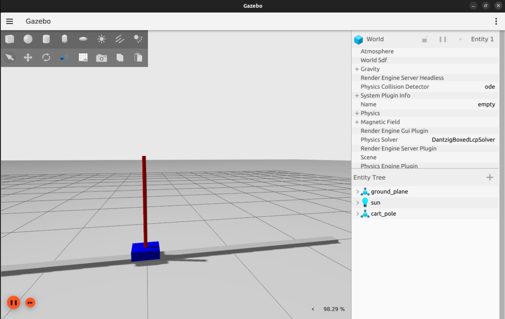

# ros2-cartpole-mrac

ROS 2 Humble implementation of an inverted cart-pole stabilization system using Model Reference Adaptive Control (MRAC) for real-time adaptive balancing and nonlinear control.

 
    
    <h3 align="center">ROS 2 Humble | Inverted Cart-Pole Stabilization using MRAC</h3> 
    
 Adaptive Real-Time Balancing & Nonlinear Control System for an Inverted Pendulum   
      
    · 
    <a href="https://github.com/rachitsrivastava2114/ros2-cartpole-mrac/issues">Report Bug</a> 
    · 
    
 

## Table of Contents

* [Project Overview](#project-overview)
  * [Objectives](#objectives)
  * [System Architecture](#system-architecture)
* [Hardware & Software Requirements](#hardware--software-requirements)
* [ROS 2 Packages](#ros-2-packages)
* [Working Principle](#working-principle)
* [Control Strategy](#control-strategy)
* [Simulation & Visualization](#simulation--visualization)
* [Verification & Testing](#verification--testing)
* [Results](#results)
* [Future Improvements](#future-improvements)
* [Authors](#authors)
* [License](#license)

## Project Overview

This project implements an adaptive stabilization system for an **Inverted Cart-Pole** using **ROS 2 Humble** and **Model Reference Adaptive Control (MRAC)**.

The controller continuously adapts system parameters in real time to stabilize the pendulum around its unstable upright equilibrium point while handling uncertainties and nonlinear dynamics.

The project demonstrates:
- Adaptive control systems
- Nonlinear dynamics stabilization
- Real-time robotics control
- ROS 2 communication architecture
- Gazebo-based dynamic simulation

 
 

### Objectives

* Design and simulate an inverted cart-pole stabilization system
* Implement MRAC adaptive control for balancing
* Develop ROS 2 Humble compatible control architecture
* Achieve real-time adaptive stabilization
* Visualize system behavior using Gazebo and RViz
* Analyze adaptive nonlinear control response

### System Architecture

The system is built around a ROS 2 Humble framework where the cart-pole model is simulated inside Gazebo. Pendulum angle and cart position are continuously monitored by the adaptive controller node.

The MRAC controller dynamically updates control parameters to minimize tracking error between the plant and reference model. ROS 2 publishers and subscribers manage communication between simulation, controller, and visualization nodes.

The complete architecture includes:
- Cart-pole dynamic model
- MRAC controller node
- Reference model
- ROS 2 communication layer
- Gazebo simulation
- RViz visualization tools

## Hardware & Software Requirements

### Software

* Ubuntu 22.04
* ROS 2 Humble
* Gazebo Simulator
* RViz2
* Python 3 / C++
* colcon build tools

### Optional Hardware

* Embedded controller platform
* Motor driver interface
* Encoder sensors
* Linear rail cart system

## ROS 2 Packages

* `cartpole_description`
* `cartpole_mrac_control`
* `cartpole_bringup`
* `cartpole_gazebo`
* `cartpole_msgs`

## Working Principle

* The cart-pole system starts in an unstable state
* Pendulum angle and cart position are continuously measured
* The MRAC controller computes adaptive corrective force inputs
* Controller gains update dynamically in real time
* Cart motion compensates for pendulum deviation
* The adaptive controller minimizes tracking error
* ROS 2 nodes exchange data in real time through topics and services
* Gazebo simulates system physics and dynamic response

 
 

## Control Strategy

* Model Reference Adaptive Control (MRAC) is implemented
* A reference model defines desired system response
* Adaptive laws update controller parameters online
* Tracking error drives adaptation mechanism
* Real-time parameter tuning improves robustness
* Control output is constrained within safe operating limits

## Simulation & Visualization

* Gazebo is used for physics-based cart-pole simulation
* RViz2 provides real-time visualization
* ROS 2 topics monitor:
  * Pendulum angle
  * Cart position
  * Adaptive gains
  * Controller output
  * System states
* rqt_graph is used for node communication analysis

## Verification & Testing

* Pendulum stabilization tested under different initial conditions
* Adaptive gain convergence analyzed
* System response evaluated under disturbances
* Real-time ROS 2 communication verified
* Gazebo simulation validated for nonlinear dynamic consistency

## Results

* Stable adaptive pendulum balancing achieved
* MRAC controller adapts successfully to changing conditions
* Improved robustness against disturbances observed
* Real-time ROS 2 communication functions correctly
* Gazebo simulation demonstrates realistic adaptive behavior

## Future Improvements

* Hybrid MRAC + Reinforcement Learning control
* Hardware implementation on embedded systems
* FPGA acceleration for adaptive control
* State estimation using Kalman filters
* Multi-link pendulum extension
* Real-world cart-pole hardware deployment

## Authors

**Rachit Srivastava**  
Bachelor of Technology – Electronics & Communication Engineering

## License

This project is developed for academic, research, and educational purposes only.
